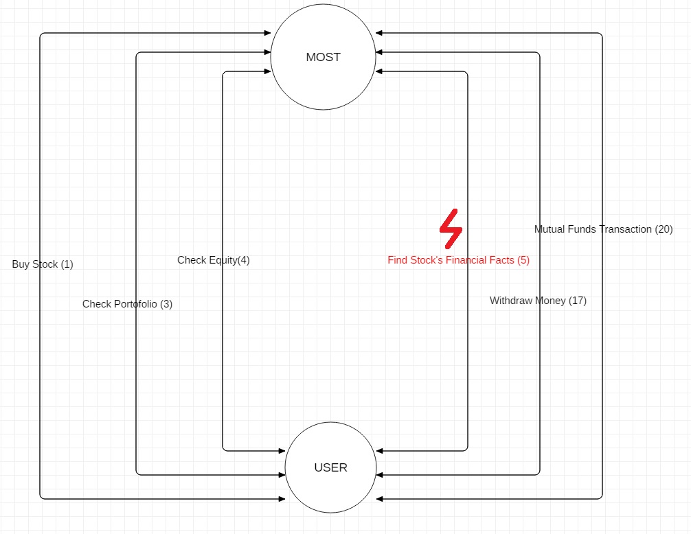

# Contextual Inquiry and Analysis of MOST

## Outline

- [Contextual Inquiry and Analysis of MOST](#contextual-inquiry-and-analysis-of-most)
  - [Outline](#outline)
  - [Description](#description)
  - [Instruction Script](#instruction-script)
  - [User Description](#user-description)
  - [Transcript](#transcript)
  - [Models and Annotations](#models-and-annotations)
    - [Artifact Model](#artifact-model)
    - [Flow Model](#flow-model)
    - [Cultural Model](#cultural-model)
  - [Do's and Don't's](#dos-and-donts)
    - [Do's](#dos)
    - [Don't's](#donts)


## Description
The stock market refers to the collection of markets and exchanges where the regular activities of buying, selling and issuance of shares of publicly held companies take place. To buy/sell an issuance of shares, investors must done it from broker or securities firm.

Securities firm in Indonesia try to provide their best service to investors. One of them is Mandiri Sekuritas. MOST is a mobile application for Mandiri Sekuritas's client (hereinafter referred to as investors). Investors can do basic operation to their account such as buying stocks, selling stocks, checking portofolio, check current equity.

## Instruction Script

1.  Buy and Sell Stock
2.	Check portofolio
3.	Check current equity
4.	Use money withdraw feature
5.	Find stock's financial fact
6.  Logout-Login Experience
## User Description
- User is a female student of Informatics Department ITS.
- Her name is Azkia.
- She is able to use smartphone.
- She has just learned stock investing.

## Transcript
```text
1. Aufa     : Ini adalah apps Mandiri Sekuritas. Dan di apps ini kita bisa eksplorasi beberapa fitur yang ada. Task pertama yaitu kita mau beli sebuah saham. Terserah deh mau beli saham apa
2. Azkia    : Udah
3. Aufa     : Gampang ya kalo buy sell. Oke, coba kalo kita lanjut ke fitur selanjutnya. Yaitu, melihat portofolio
4. Azkia    : Oke, ini juga kelihatan equitynya ya
5. Aufa     : Oke, gampang ya. Nah, tugas selanjutnya adalah kita mau melihat laporan keuangan perusahaan. Tiap perusahaan kan punya laporan keuangan. Nah kalo di apps ini cara liatnya gimana
6. Azkia    : Ini apa? Ini ga?
7. Aufa     : Lho gatau haha. Coba kita cari supaya seintuitif mungkin.
8. Azkia    : Mana sih??
9. Aufa     : Rahasia dong. Coba cari lagi
*2 minutes passing by*
10. Azkia   : Ini gasih?
11. Aufa    : Lho kalo itu kan buat cari sahamnya.
12. Azkia   : Masuk disini ga?
13. Aufa    : Bukaan bukaan wkwk
14. Azkia   : Nyerah deh
15. Aufa    : Coba masuk ke saham tertentu. Nah disitu kan ada area barnya. Coba scroll ke kanan sampai nemu financial sheet. 
16. Azkia   : Oalaah
17. Aufa    : Oke, task selanjutnya misalkan aku ada uang di rekening terus mau di *withdraw* , caranya gimana?
18. Azkia   : Caranya gimana?
19. Aufa    : Ya gatau lah.
20. Aufa    : Oke bener. Nah ada satu fitur yang out-of the box. Yaitu kita juga bisa beli reksadana. Nah coba kita kalo mau beli reksadana gimana caranya?
21. Azkia   : Bingung aku
22. Aufa    : Yes bener gitu caranya. Coba kalo mau beli gimana caranya?
23. Azkia   : Gini ya caranya
24. Aufa    : Nah coba kalo sign out terus sign in lagi.
25. Azkia   : *tapping back button often*
26. Aufa    : Gimana pengalamannya?
27. Azkia   : Biasa aja sih
28. Aufa    : Lho tapikan kamu butuh berkali-kali tapping buat keluar gitu heheh
29. Azkia   : Oalaah iyaiya
30. Aufa    : Nah, menurutmu aplikasinya Mandiri Sekuritas ini gimana?
31. Azkia   : Hmm. menurutku bagus sih cuma iya bener kurang intuitif gitu. Terus text-text nya ini lho terlalu berdesakan menurutku. Kurang ada spasinya.
32. Aufa    : Oke thankyou yah.
```
## Models and Annotations
### Artifact Model


### Flow Model

### Cultural Model

## Do's and Don't's
### Do's

1. Place more iconic icon
2. Pleasant view design rather than a compact and full of text
3. Shadows for interactive box
4. Make it more intuitive 
  
### Don't's

1. Single color for every decision (exit, login, confirming) 

# Remarks
> * Thanks for completing all the parts in this assignment.
> * You should not expose the participant's name in the report.
> * The `Cultural Model` should illustrate the relationship between the participant and his/her environment/friends/experience that may affect their feeling or the way they use the system (MOST). The current model is more like Artifact Model without screenshot. Please revisit the theoritical background and the examples of cultural/ social models to get better understanding.
> * `Do's` #1 #2 #3 are good. But, #4 is too general. It should be more specific: how to achieve the intuitive design? etc.


| Working Days | Commits before D | Commits after D | Presentation (80%) | Repo (20%) | Total |
|:------------:|:----------------:|:---------------:|:------------------:|:----------:|:-----:|
| 1            | 7                | 0               | 85,5               | 79         | 84,2  |
